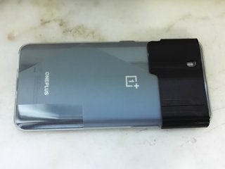
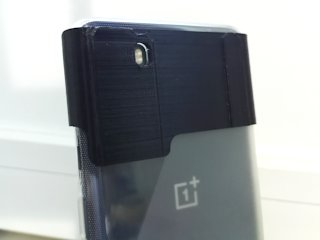
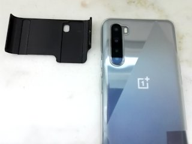

# OnePlus Nord Camera Cover
*3D printable simple cover for the OnePlus Nord when using the stock bumper case*

### License
[Creative Commons - Attribution](https://creativecommons.org/licenses/by/4.0/)

### Gallery

[🔎](images/photo1.jpg) [🔎](images/photo2.jpg) [🔎](images/photo3.jpg)

## Description and Instructions

This is a simple sliding cover that protects the camera lenses on the OnePlus Nord smartphone from smudges and dirt, and may also help with privacy by ensuring the cameras at the rear aren't taking pictures at unexpected moments. This cover is designed to fit the bumper case that comes with the Nord (or at least the one that came with mine, I'm not sure if this is always the same model.) It might fit other cases as well.

Just slide it on or off from the top of the phone. There is a hole for the flashlight such that it can be used without having to remove the cover. The cover can be stored at the other end of the phone while taking photos.

### Printing

I printed this in PETG at 0.15 mm layer resolution. Any material will do, but PETG is recommended due to its toughness.

Print the model upright and ‘upside down’ as provided in the STL file. This will make it the strongest and also avoids any need for supports. If you have problems with adhesion due to the small contact surface, try adding a brim or raft.

If the cover is too tight or too sloppy, try scaling it up or down in the X dimension by some fractions of a percent. You can print only a slice of the entire model to check the fit before doing the full print.

### Post-processing

The model has sharp corners at the top (actually the bottom during printing) to provide good support during printing, but you will probably want to sand or file these down to get smooth rounded corners. Some sanding may also be needed in other places to get rid of any remaining sharp edges that could snag on clothing.

## Updates

### 2021/07/07
First published.

### 2022/08/27
Tweaked model and added little nubs that better hold the cover in place.
